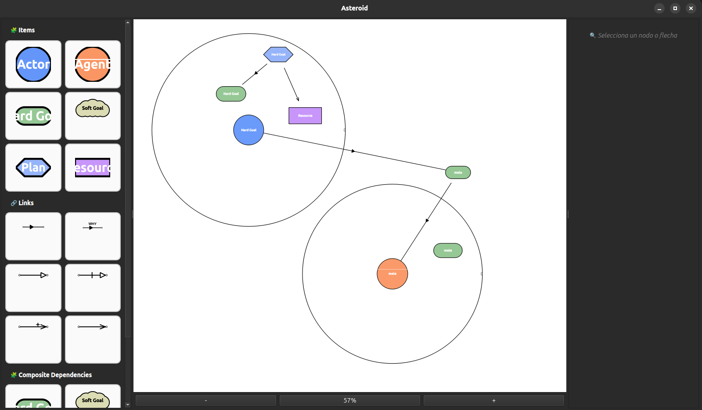
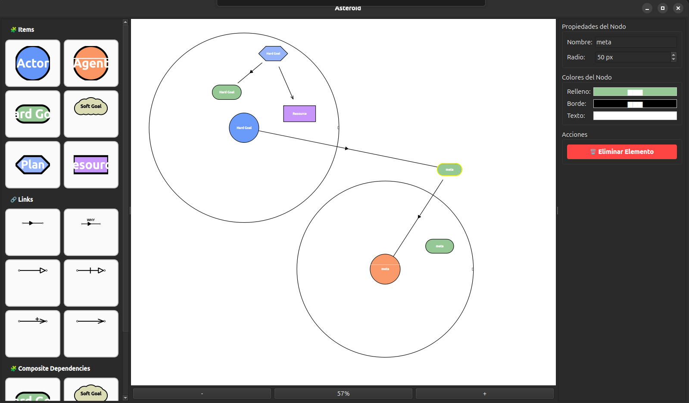
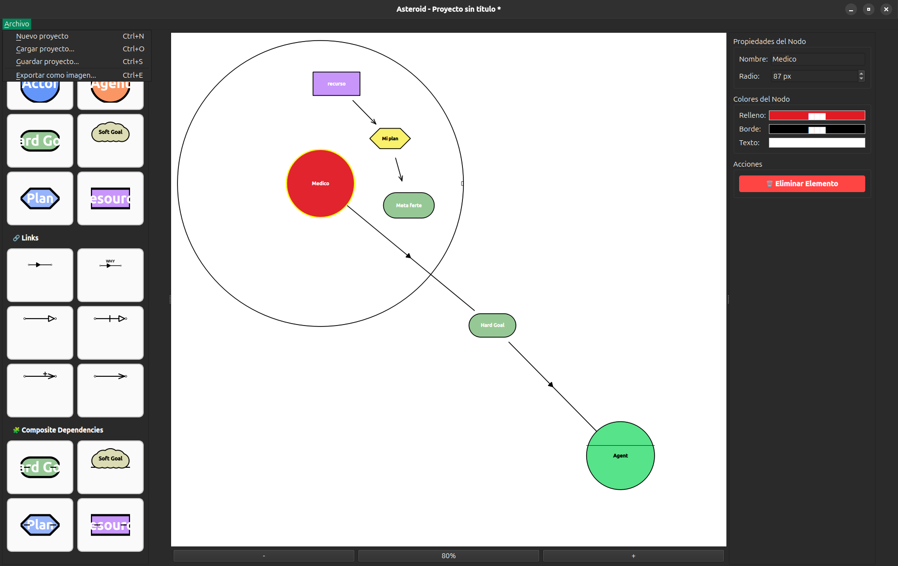

# 🌌 Asteroid — Interactive Diagramming I* Tropos Desktop App


**Asteroid** is a desktop application built with **Python** and **PyQt6** to create interactive, model-driven diagrams — ideal for visualizing Tropos-style actor-agent relationships, dependencies, and resources.  
It follows a clean **MVC-inspired architecture**, strictly separating **core models**, **UI components**, and **controllers** for maximum modularity and maintainability.

> 💡 Built with **`uv`** as the *exclusive* Python package manager — no `pip`, no `venv` manual setup. Just `uv`.

---

## 🚀 Features

- **Interactive QGraphicsView canvas** with:
  - Drag & drop nodes from a sidebar (Actor, Agent, Goal, Resource, etc.)
  - Support for **simple and dashed arrows** (dependencies)
  - Zoom in/out, pan, and reset view
- **Logical models decoupled** from graphical representation (e.g., `Actor` ≠ `ActorNodeItem`)
- **Controller layer** managing interactions between UI and domain logic
- **Extensible design**: Easily add new node types, edge styles, or behaviors
- **Built for collaboration**: Clear separation enables team development and testing

---

## 🏗️ Project Structure
app/

├── core/

│   └── models/

│       ├── entity/           # Actor, Agent, Entity (base 
class)

│       ├── artifact/          # Goal, Softgoal, Task, Resource, Belief

│       └── dependency/       # Dependency, TaskDependency, ResourceDependency, etc.

├── ui/

│   ├── components/           # QGraphicsItems: ActorNodeItem, EdgeItem, etc.

│   ├── controllers/          # CanvasController
│   ├── canvas.py             # Main QGraphicsView + scene

│   ├── sidebar.py            # Draggable node palette

│   └── main_window.py        # QMainWindow with menu, toolbar, status bar

└── main.py                   # Entry point: initializes app and window


---

## ⚙️ Requirements

- ✅ **Python 3.12.3+**
- ✅ **[uv](https://github.com/astral-sh/uv)** — *the only package manager used*
- ✅ **PyQt6**

> 🛑 **No `pip`, no `requirements.txt` installation via pip.**  
> This project uses **`uv`** exclusively to manage virtual environments and dependencies — ensuring fast, deterministic, and reproducible setups across all platforms.

---

## 📦 Installation & Setup (Using `uv`)

### Step 1: Install `uv` (if not already installed)

```bash
curl -LsSf https://astral.sh/uv/install.sh | sh
```

### Step 2...

### Step 3: Run project
```bash
uv run main.py
```

# Examples





## 📋 TODO & Roadmap

- [x] **Actor/agent node movement within subcanvas** — Allow reorganization of child nodes internally *(completed Dec 24)*
- [x] **Size property for component names** — Configurable text size for different components
- [x] **Multi-line text labels** — Support for writing text in multiple lines within node labels
- [x] **Review of softgoal visual component** — check for a better form of softgoal ui component 
- [ ] **Cross-platform packaging** — Research options for:
  - `.deb`/APT package (golden dream for Linux)
  - Windows installer (NSIS/InnoSetup)
  - macOS app bundle
  - PyInstaller/Cx_Freeze as intermediate solution
- [ ] **Visual themes** — Customizable light/dark theme system
- [ ] **Model validation** — Diagram consistency verification according to Tropos methodology
- [ ] **Undo/redo history** — Complete undo/redo system for all actions
- [x] **Keyboard shortcuts** — Comprehensive shortcut system for common operations
- [ ] **Diagram templates** — Pre-built templates for common Tropos patterns

---

**✨ Contributions Welcome** — Feel free to fork the project or open issues to discuss new features!