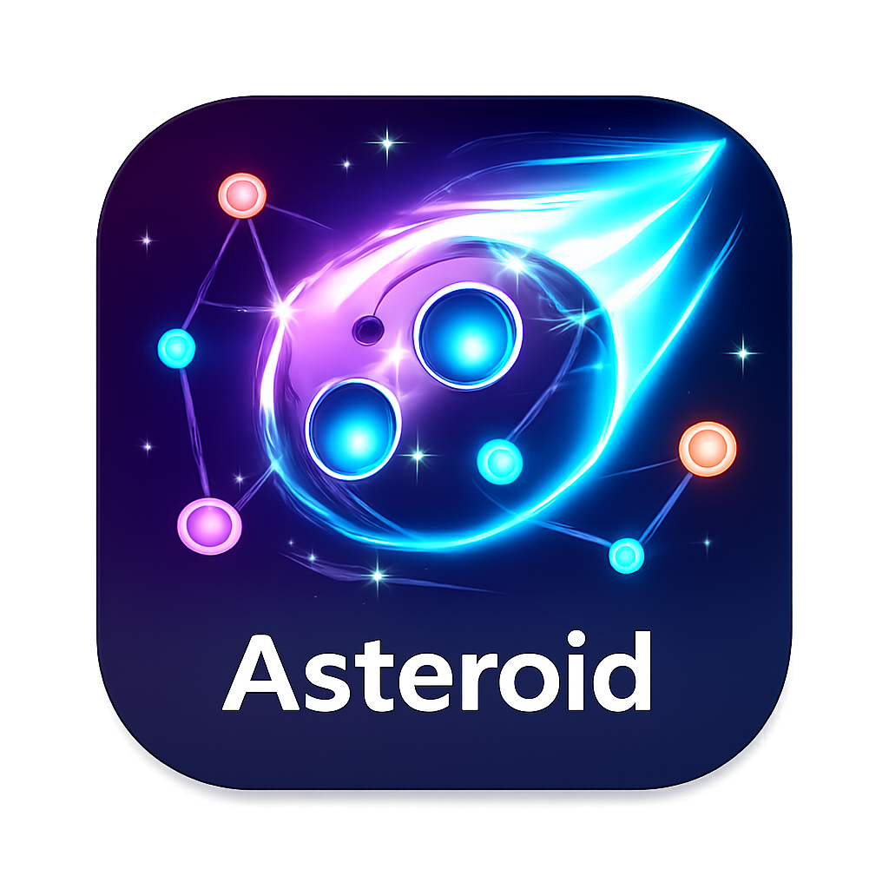
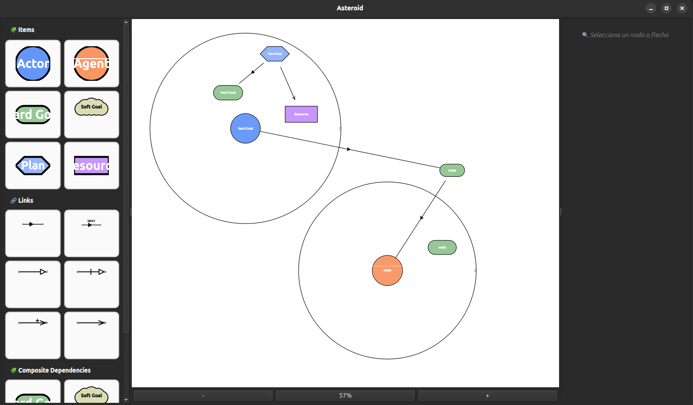
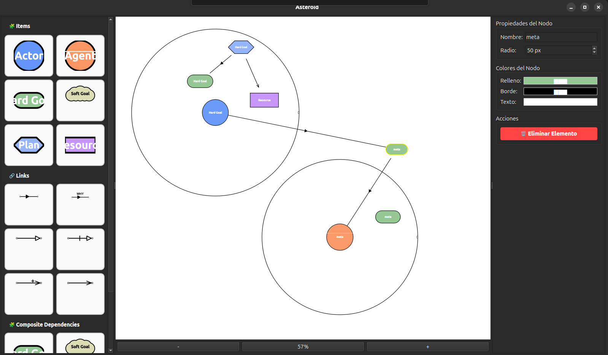
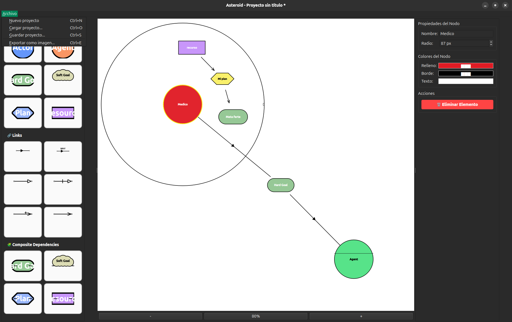

# 🌌 Asteroid — Interactive Diagramming Tool for Tropos and i* Methodologies

<p align="center">
  
</p>

[](https://www.python.org/downloads/)
[](LICENSE)
[](https://www.riverbankcomputing.com/software/pyqt/)
[](https://github.com/DaryllLorenzo/asteroid/stargazers)
[](https://github.com/DaryllLorenzo/asteroid/releases/latest)

**Asteroid** is a desktop application for creating interactive, model-driven diagrams, specifically designed for visualizing **Tropos** and **i*** (i-star) methodologies. It supports actor-agent relationships, dependencies, goals, resources, and more.

Built with **Python** and **PyQt6**, it follows a clean **MVC-inspired architecture** that strictly separates core models, UI components, and controllers for maximum modularity and maintainability.

🌐 **[Visit the official website](https://darylllorenzo.github.io/asteroid-landing/)** | 📥 **[Download latest release](https://github.com/DaryllLorenzo/asteroid/releases)**

---

## 🚀 Features

### Core Diagramming
- **Interactive QGraphicsView canvas** with:
  - Drag & drop nodes from a sidebar (Actor, Agent, Goal, Resource, Softgoal, Plan)
  - Support for **simple and dashed arrows** (dependencies, contributions, means-end)
  - Zoom in/out, pan, and reset view

### Export & Documentation
- **PDF Export** with two modes:
  - Diagram image only
  - Diagram + detailed element information (classification and relationships)
- **Built-in help system** with Markdown documentation

### Architecture
- **Logical models decoupled** from graphical representation (`Actor` ≠ `ActorNodeItem`)
- **Controller layer** managing interactions between UI and domain logic
- **Extensible design**: Easily add new node types, edge styles, or behaviors
- **Built for collaboration**: Clear separation enables team development and testing

### Cross-Platform
- Windows 10/11 executable
- Linux (.deb package for Debian/Ubuntu)
- macOS app bundle

---

## 🏗️ Project Structure

```
asteroid/
├── app/
│   ├── controllers/          # Canvas logic and state management
│   │   ├── canvas_controller.py
│   │   └── __init__.py
│   ├── core/                 # Business logic and data models
│   │   ├── models/           # Tropos/i* element definitions
│   │   │   ├── entity/       # Actor, Agent
│   │   │   ├── tropos_element/ # Goal, Softgoal, Plan, Resource
│   │   │   └── dependency/   # Edge types (contribution, means-end, etc.)
│   ├── ui/                   # PyQt6 interface components
│   │   ├── canvas.py         # Main drawing area
│   │   ├── sidebar.py        # Element toolbar
│   │   ├── components/       # Visual items for nodes and edges
│   │   │   ├── dependency_item/  # Edge types (arrows, links)
│   │   │   ├── entity_item/      # Actor, Agent nodes
│   │   │   ├── tropos_element_item/ # Goals, Resources, Plans
│   │   │   ├── base_edge_item.py   # Base class for edges
│   │   │   ├── base_node_item.py   # Base class for nodes
│   │   │   ├── base_tropos_item.py # Base class for Tropos elements
│   │   │   ├── control_point_handle.py  # Flexible edge control points
│   │   │   ├── position_controll_widget.py  # Position control UI
│   │   │   ├── properties_panel.py   # Properties sidebar panel
│   │   │   └── subcanvas_item.py     # Subcanvas component
│   │   └── help/             # Markdown documentation system
│   └── utils/                # PDF export and serialization
│       ├── astr_format.py    # ASTR file format serialization
│       └── pdf_export.py     # PDF export functionality
├── images/                   # Static assets and screenshots
├── main.py                   # Application entry point
├── pyproject.toml            # Project dependencies
└── README.md
```

---

## ⚙️ Requirements

| Requirement | Version |
|-------------|---------|
| Python | 3.12.3+ |
| PyQt6 | 6.8.0+ |
| numpy | 2.0.0+ |
| reportlab | 4.2.0+ |
| markdown | 3.7+ |

---

## 📦 Installation

### Option 1: Using `uv` (recommended)

```bash
# Install uv (if not already installed)
curl -LsSf https://astral.sh/uv/install.sh | sh

# Clone and run
git clone https://github.com/DaryllLorenzo/asteroid.git
cd asteroid
uv run main.py
```

### Option 2: Using `pip` and `venv`

```bash
# Clone the repository
git clone https://github.com/DaryllLorenzo/asteroid.git
cd asteroid

# Create virtual environment
python -m venv .venv
source .venv/bin/activate  # Linux/macOS
# .venv\Scripts\activate   # Windows

# Install dependencies
pip install markdown numpy pyqt6 reportlab

# Run the application
python main.py
```

> 💡 **Tip:** Option 1 with `uv` is faster and ensures reproducible dependencies.

---

## 🖼️ Screenshots

| Main Interface | Actor with Subcanvas |
|----------------|---------------------|
|  |  |



---

## 📋 Roadmap

### Completed
- [x] Actor/agent node movement within subcanvas
- [x] Configurable text size for components
- [x] Multi-line text labels in nodes
- [x] Softgoal visual component improvements
- [x] Cross-platform packaging (Windows, Linux, macOS)
- [x] Keyboard shortcuts system
- [x] Flexible link shapes (user-draggable control points for edges)

### In Progress / Planned
- [ ] Visual themes (light/dark mode)
- [ ] Model validation (Tropos methodology consistency)
- [ ] Undo/redo history for all actions
- [ ] Diagram templates for common Tropos patterns
- [ ] Multi-language support (English, Spanish) with language switcher

---

## 🤝 Contributing

Contributions are welcome! Here's how you can help:

1. **Fork the repository**
2. **Create a feature branch**: `git checkout -b feature/amazing-feature`
3. **Commit your changes**: `git commit -m 'Add amazing feature'`
4. **Push**: `git push origin feature/amazing-feature`
5. **Open a Pull Request**

Please read our [contributing guidelines](CONTRIBUTING.md) for more details.

### Reporting Issues
Found a bug? Have a feature request? [Open an issue](https://github.com/DaryllLorenzo/asteroid/issues) with a clear description and, if possible, steps to reproduce.

---

## 📄 License

Distributed under the MIT License. See [LICENSE](LICENSE) for more information.

---

## 📬 Contact & Acknowledgments

- **Author**: Daryll Lorenzo
- **Project Website**: [https://darylllorenzo.github.io/asteroid-landing/](https://darylllorenzo.github.io/asteroid-landing/)
- **GitHub Repository**: [https://github.com/DaryllLorenzo/asteroid](https://github.com/DaryllLorenzo/asteroid)

Built with PyQt6, special thanks to the Qt and Python communities.