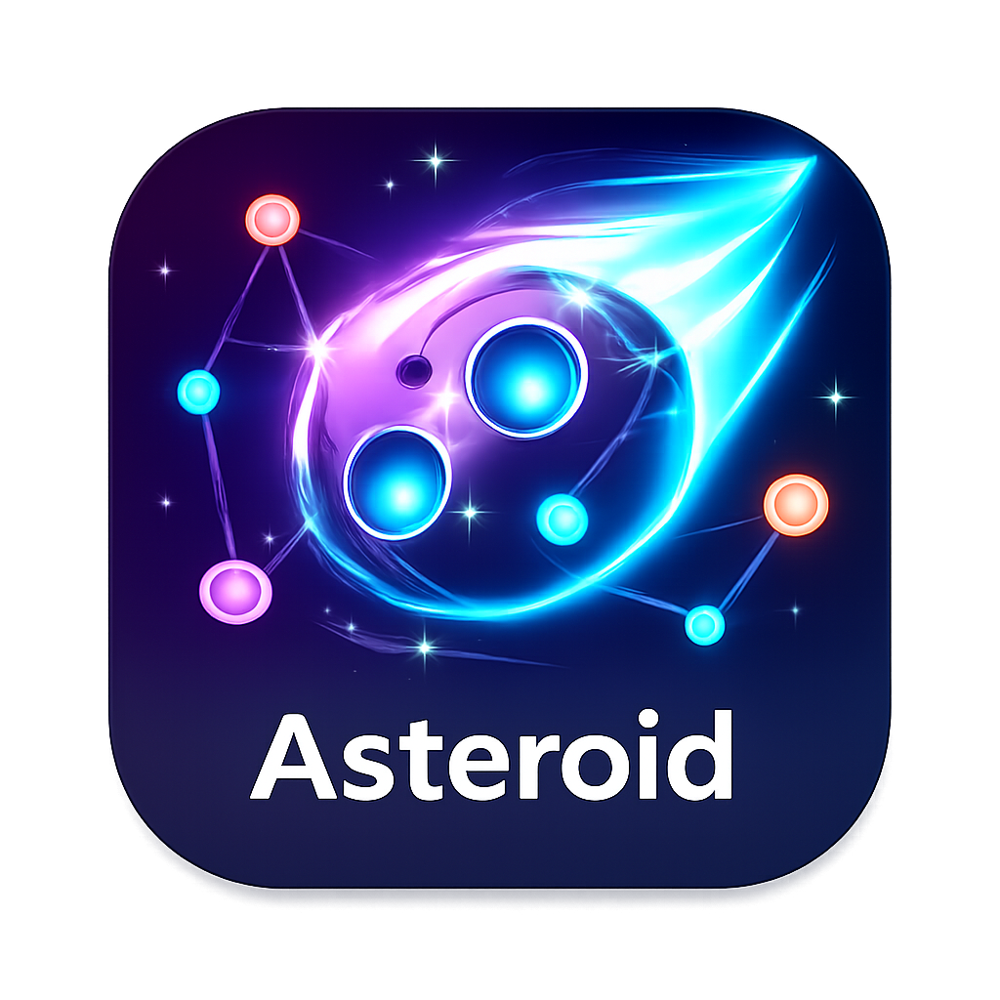
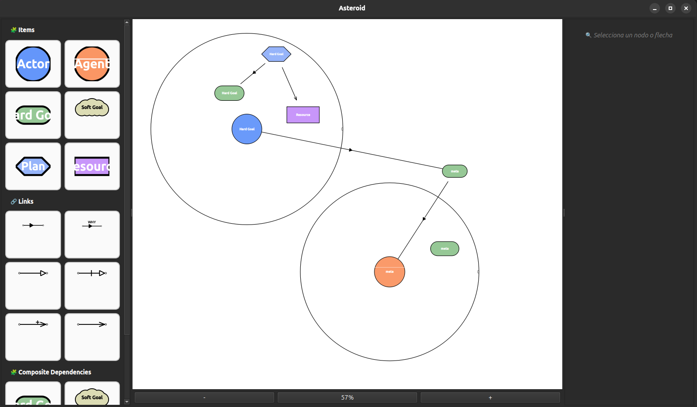
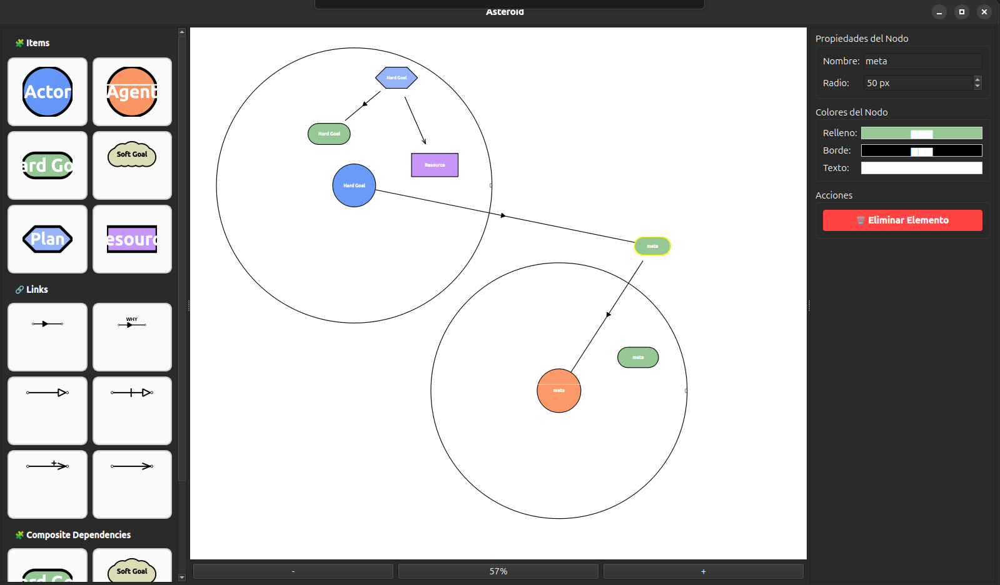
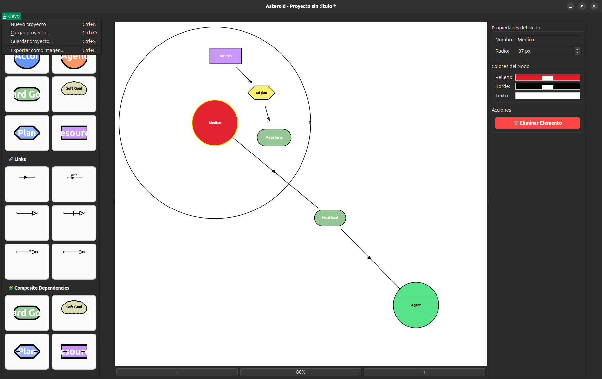

# Asteroid — Interactive Diagramming Tool for Tropos and i* Methodologies

<p align="center">
  
</p>

[](https://www.python.org/downloads/)
[](LICENSE)
[](https://www.riverbankcomputing.com/software/pyqt/)
[](https://github.com/DaryllLorenzo/asteroid/stargazers)
[](https://github.com/DaryllLorenzo/asteroid/releases/latest)

**Asteroid** is a desktop application for creating interactive, model-driven diagrams, specifically designed for visualizing **Tropos** and **i*** (i-star) methodologies. It supports actor-agent relationships, dependencies, goals, resources, and more.

Built with **Python** and **PyQt6**, it follows a clean **MVC-inspired architecture** that strictly separates core models, UI components, and controllers for maximum modularity and maintainability.

🌐 **[Visit the official website](https://darylllorenzo.github.io/asteroid-landing/)** | 📥 **[Download latest release](https://github.com/DaryllLorenzo/asteroid/releases)**

---

## Features

### Core Diagramming
- **Interactive QGraphicsView canvas** with:
  - Drag & drop nodes from a sidebar (Actor, Agent, Goal, Resource, Softgoal, Plan)
  - Support for **simple and dashed arrows** (dependencies, contributions, means-end)
  - Zoom in/out, pan, and reset view

### Export & Documentation
- **PDF Export** with two modes:
  - Diagram image only
  - Diagram + detailed element information (classification and relationships)
- **Built-in help system** with Markdown documentation

### Architecture
- **Logical models decoupled** from graphical representation (`Actor` ≠ `ActorNodeItem`)
- **Controller layer** managing interactions between UI and domain logic (MVC pattern)
- **Extensible design**: Easily add new node types, edge styles, or behaviors
- **Built for collaboration**: Clear separation enables team development and testing
- **Type safety**: Full type annotations with mypy validation (0 errors, strict mode compatible)

### Cross-Platform
- Windows 10/11 executable
- Linux (.deb package for Debian/Ubuntu)
- macOS app bundle

---

## Project Structure

```text
asteroid/
├── .gitignore
├── CONTRIBUTING.md
├── LICENSE
├── README.md
├── app/
│   ├── __init__.py
│   ├── model_types.py                  # Type definitions for models
│   ├── controller_types.py             # Type definitions for controllers
│   ├── commands/                       # Undo/redo command pattern
│   │   ├── add_node_command.py         # Undoable node creation
│   │   ├── delete_node_command.py      # Undoable node deletion (recursive)
│   │   ├── add_edge_command.py         # Undoable edge creation
│   │   ├── delete_edge_command.py      # Undoable edge deletion
│   │   ├── add_subcanvas_node_command.py  # Undoable subcanvas child creation
│   │   ├── add_composite_dependency_command.py  # Undoable composite dependency
│   │   ├── toggle_subcanvas_command.py # Undoable subcanvas open/close
│   │   ├── move_node_command.py        # Undoable node movement (with merge)
│   │   ├── resize_node_command.py      # Undoable node resize
│   │   ├── change_property_command.py  # Undoable property changes (with merge)
│   │   └── change_control_points_command.py  # Undoable control point edits
│   ├── controllers/                    # Canvas logic (MVC pattern)
│   │   ├── __init__.py
│   │   ├── _canvas_mixin.py            # Mixin for shared controller logic
│   │   ├── canvas_controller.py        # Orchestrator: combines all controllers
│   │   ├── canvas_deletion_controller.py   # Delete nodes/edges/selection
│   │   ├── canvas_export_controller.py     # Export to .astr or image
│   │   ├── canvas_import_controller.py     # Import from .astr
│   │   ├── canvas_interaction_controller.py  # Node and arrow interaction
│   │   ├── canvas_node_controller.py      # Add/move nodes
│   │   ├── canvas_registry_controller.py  # Node/edge type registration
│   │   └── canvas_state_controller.py    # Project state (modified/saved)
│   ├── core/                           # Domain models (business logic)
│   │   ├── __init__.py
│   │   └── models/
│   │       ├── __init__.py
│   │       ├── base_node.py            # Base class for all nodes
│   │       ├── base_edge.py            # Base class for all edges
│   │       ├── composite_model_wrapper.py  # Syncs external/internal models
│   │       ├── dependency/             # Dependency models
│   │       │   ├── __init__.py
│   │       │   ├── dependency_link_edge.py
│   │       │   ├── why_link_edge.py
│   │       │   ├── means_end_edge.py
│   │       │   ├── or_decomposition_edge.py
│   │       │   ├── and_decomposition_edge.py
│   │       │   └── contribution_edge.py
│   │       ├── entity/                 # Entity models
│   │       │   ├── __init__.py
│   │       │   ├── actor.py
│   │       │   └── agent.py
│   │       └── tropos_element/         # Tropos element models
│   │           ├── __init__.py
│   │           ├── hard_goal.py
│   │           ├── soft_goal.py
│   │           ├── plan.py
│   │           └── resource.py
│   ├── ui/                             # PyQt6 interface (View)
│   │   ├── __init__.py
│   │   ├── canvas.py                  # Main QGraphicsView
│   │   ├── main_window.py             # Main window
│   │   ├── pdf_export_dialog.py      # PDF export dialog
│   │   ├── sidebar.py                 # Sidebar with draggable elements
│   │   ├── components/
│   │   │   ├── __init__.py
│   │   │   ├── base_node_item.py             # Base for node items
│   │   │   ├── base_edge_item.py             # Base for edge items
│   │   │   ├── base_tropos_item.py           # Base for Tropos items
│   │   │   ├── control_point_handle.py       # Control point handle
│   │   │   ├── subcanvas_item.py             # Subcanvas item
│   │   │   ├── position_controll_widget.py   # Position control widget
│   │   │   ├── properties_panel.py           # Properties panel
│   │   │   ├── dependency_item/             # Edge items
│   │   │   │   ├── __init__.py
│   │   │   │   ├── dependency_link_edge_item.py
│   │   │   │   ├── why_link_edge_item.py
│   │   │   │   ├── means_end_edge_item.py
│   │   │   │   ├── or_decomposition_edge_item.py
│   │   │   │   ├── and_decomposition_edge_item.py
│   │   │   │   └── contribution_edge_item.py
│   │   │   ├── entity_item/                 # Entity items
│   │   │   │   ├── __init__.py
│   │   │   │   ├── actor_node_item.py
│   │   │   │   └── agent_node_item.py
│   │   │   └── tropos_element_item/        # Tropos element items
│   │   │       ├── __init__.py
│   │   │       ├── hard_goal_item.py
│   │   │       ├── soft_goal_item.py
│   │   │       ├── plan_item.py
│   │   │       └── resource_item.py
│   │   └── help/                       # Help system
│   │       ├── help_modal.py           
│   │       ├── markdown_viewer.py
│   │       └── content/
│   │           ├── about.md
│   │           ├── elements.md
│   │           ├── examples.md
│   │           └── quick_help.md
│   └── utils/                    # Utils (serialization, export)
│       ├── astr_format.py       # .astr serializer
│       └── pdf_export.py        # PDFs generator
├── images/
│   ├── AsteroidLogo.png
│   ├── main_interface_example1.png
│   ├── main_interface_example2.png
│   └── main_interface_example3.png
├── main.py
├── pyproject.toml
└── uv.lock
```

---

## Requirements

| Requirement | Version |
|-------------|---------|
| Python | 3.12.3+ |
| PyQt6 | 6.8.0+ |
| numpy | 2.0.0+ |
| reportlab | 4.2.0+ |
| markdown | 3.7+ |

---

## Installation

### Option 1: Using `uv` (recommended)

```bash
# Install uv (if not already installed)
curl -LsSf https://astral.sh/uv/install.sh | sh

# Clone and run
git clone https://github.com/DaryllLorenzo/asteroid.git
cd asteroid
uv run main.py
```

### Option 2: Using `pip` and `venv`

```bash
# Clone the repository
git clone https://github.com/DaryllLorenzo/asteroid.git
cd asteroid

# Create virtual environment
python -m venv .venv
source .venv/bin/activate  # Linux/macOS
# .venv\Scripts\activate   # Windows

# Install dependencies
pip install markdown numpy pyqt6 reportlab

# Run the application
python main.py
```

> 💡 **Tip:** Option 1 with `uv` is faster and ensures reproducible dependencies.

---

## Screenshots

| Main Interface | Actor with Subcanvas |
|----------------|---------------------|
|  |  |



---

## Roadmap

### Completed
- [x] Actor/agent node movement within subcanvas
- [x] Configurable text size for components
- [x] Multi-line text labels in nodes
- [x] Softgoal visual component improvements
- [x] Cross-platform packaging (Windows, Linux, macOS)
- [x] Keyboard shortcuts system
- [x] Flexible link shapes (user-draggable control points for edges)
- [x] Full undo/redo history (Ctrl+Z / Ctrl+Y / Ctrl+Shift+Z)
    - Node creation, deletion, movement, resize
    - Edge creation, deletion
    - Property changes (with rapid-change merging)
    - Subcanvas open/close
    - Composite dependency creation/deletion
    - Control point add/move/remove/clear

### In Progress / Planned
- [ ] Visual themes (light/dark mode)
- [ ] Model validation (Tropos methodology consistency)
- [ ] Diagram templates for common Tropos patterns
- [ ] Multi-language support (English, Spanish) with language switcher

---

## Contributing

Contributions are welcome! Here's how you can help:

1. **Fork the repository**
2. **Create a feature branch**: `git checkout -b feature/amazing-feature`
3. **Commit your changes**: `git commit -m 'Add amazing feature'`
4. **Push**: `git push origin feature/amazing-feature`
5. **Open a Pull Request**

Please read our [contributing guidelines](CONTRIBUTING.md) for more details.

### Reporting Issues
Found a bug? Have a feature request? [Open an issue](https://github.com/DaryllLorenzo/asteroid/issues) with a clear description and, if possible, steps to reproduce.

---

## License

Distributed under the MIT License. See [LICENSE](LICENSE) for more information.

---

## Contact & Acknowledgments

- **Author**: Daryll Lorenzo
- **Project Website**: [https://darylllorenzo.github.io/asteroid-landing/](https://darylllorenzo.github.io/asteroid-landing/)
- **GitHub Repository**: [https://github.com/DaryllLorenzo/asteroid](https://github.com/DaryllLorenzo/asteroid)

Built with PyQt6, special thanks to the Qt and Python communities.
